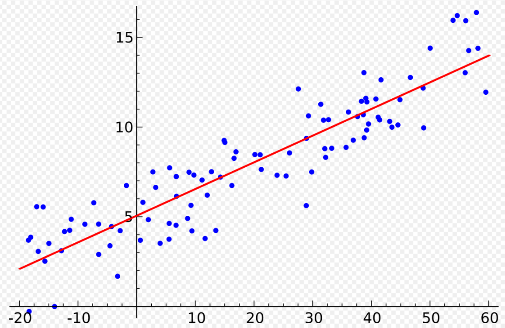

## Marco teorico
### Multilayer Perceptron (MLP)
Un Multilayer Perceptron (MLP) es un tipo de red neuronal feedforward que consiste en una capa de entrada, una o más capas ocultas, y una capa de salida. Cada neurona utiliza funciones de activación no lineales (sigmoide, tanh, ReLU, etc.), las redes MLP pueden aproximar funciones complejas y no lineales.

Un Multilayer Perceptron (MLP) es un tipo de red neuronal feedforward que consiste en una capa de entrada, una o más capas ocultas, y una capa de salida. Cada neurona utiliza funciones de activación no lineales (sigmoide, tanh, ReLU, etc.), las redes MLP pueden aproximar funciones complejas y no lineales.

El aprendizaje se realiza mediante propagación hacia atrás (backpropagation), optimizando los pesos para minimizar la función de error (por ejemplo, error cuadrático medio) y cada neurona calcula una suma ponderada de entradas, aplica una no linealidad, y pasa su salida a la siguiente capa.

>Figura 1

### Regresión Lineal
La regresión lineal es un método estadístico/aprendizaje supervisado que modela la relación entre variables independientes (_X_) y una variable dependiente (_Y_) mediante una ecuación lineal para múltiples variables predictoras se usa regresión lineal múltiple:
_Y = β0 + β1X + ε_

Para su funcionamiento se encuentra la línea de mejor ajuste minimizando el error cuadrático medio (Least Squares), el modelo asume linealidad, independencia de errores, homocedasticidad, normalidad de residuos, entre otras. Este modelo es fácil de interpretar y rápido de entrenar, ideal para predicciones básicas y análisis exploratorio.

>Figura 2

### Comparación: MLP vs. Regresión Lineal
* Regresión Lineal: solo puede capturar relaciones lineales entre variables.
* Regresión Lineal: entrenamiento analítico (mínimos cuadrados) o con gradiente descendente; suele ser rápido y convergente.
* Regresión Lineal: altamente interpretable, coeficientes explican el efecto de cada variable.
* Usa regresión lineal cuando los datos muestren relaciones lineales claras y quieras interpretabilidad rápida.
#
* MLP: gracias a sus capas ocultas y activaciones no lineales, puede aproximar funciones arbitrariamente complejas (no lineales).
* MLP: entrenamiento iterativo con backpropagation y métodos de optimización; sensible a hiperparámetros (arquitectura, tasa de aprendizaje).
* MLP: caja negra; difícil de interpretar los pesos internos y requerimientos computacionales más altos.
* El MLP es más adecuado cuando se anticipan patrones no lineales complejos y tienes capacidad computacional para entrenarlo.
#
* La principal diferencia radica en presencia de no linealidades y profundidad.
* Un MLP sin capa oculta (una sola capa) y sin activación no lineal equivale exactamente a una regresión lineal.

[⬅️ Volver al Índice](./indice.md)

